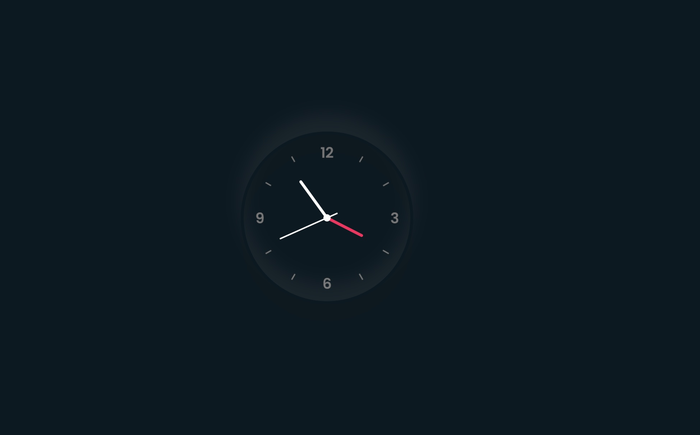

This is a learning project.
Using HTML, CSS and JS to create a clock.
Present by [Online Tutorials](https://www.youtube.com/watch?v=weZFfrjF-k4&ab_channel=OnlineTutorials)

[Live link](https://crankycat-loves-coding.github.io/JS-clock/)